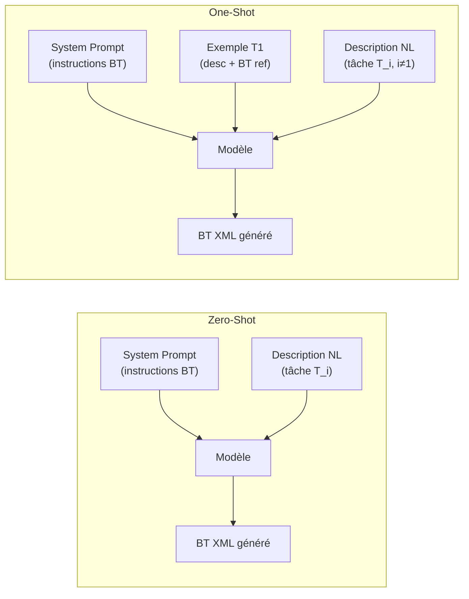
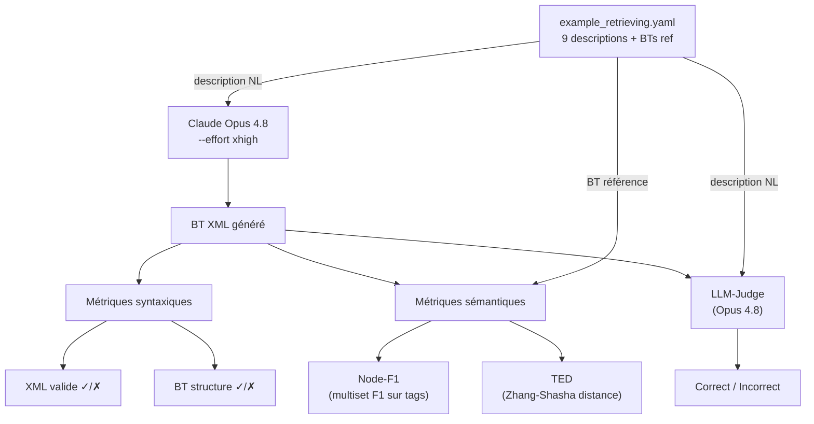
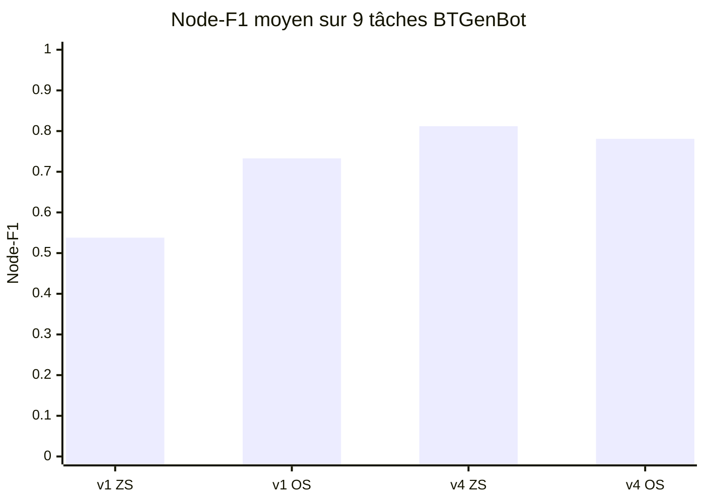
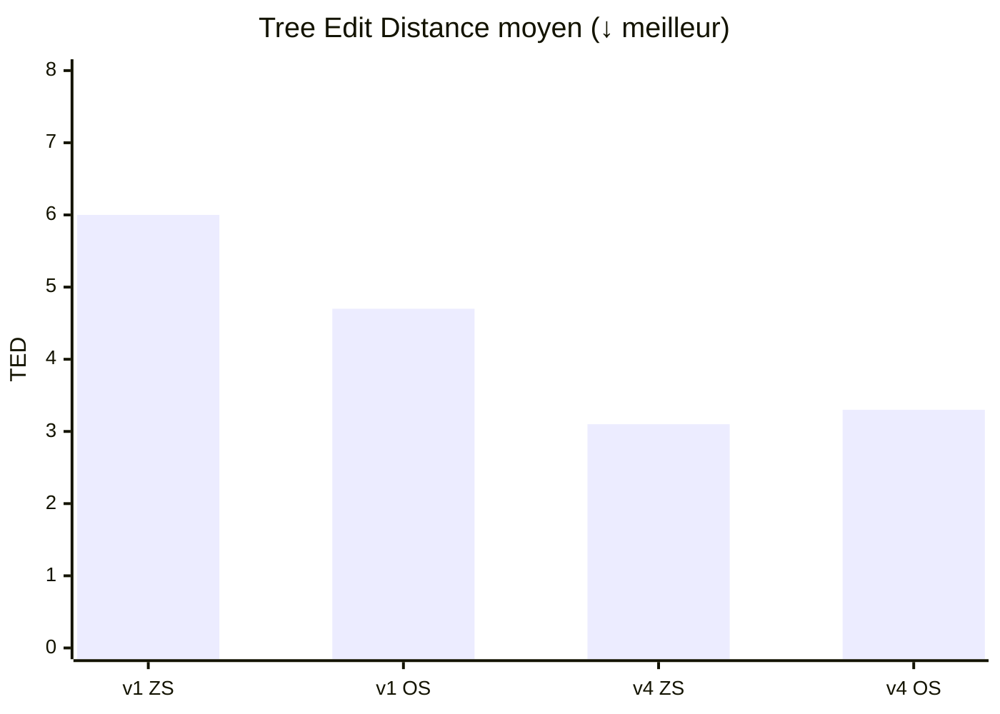

# Baseline Évaluation — Claude Opus 4.8 sur les 9 tâches BTGenBot

> **Contexte :** Avant de lancer le fine-tuning SFT QLoRA (Llama-3.1-8B, Qwen2.5-7B, Qwen2.5-Coder-7B) sur cluster GPU, on établit une **baseline zero-shot** avec Claude Opus 4.8. Cette baseline constitue un plafond de référence pour mesurer le gain apporté par le fine-tuning.
>
> Résultats obtenus le 2026-06-03 — script `scripts/eval_paper_tasks.py`.

---

## 1. Protocole d'évaluation

### 1.1 Les 9 tâches du papier (Izzo 2024)

Le papier BTGenBot n'évalue **pas** ses modèles sur le dataset d'entraînement (594 paires description→BT). Il définit 9 tâches standardisées couvrant des domaines robotiques croissants en complexité :

| ID | Tâche | Complexité |
|----|-------|-----------|
| T1 | Navigation simple | ★☆☆☆ |
| T2 | Navigation avec priorité | ★★☆☆ |
| T3 | Navigation avec fallback | ★★☆☆ |
| T4 | Navigation + bras manipulateur | ★★☆☆ |
| T5 | Exploration autonome | ★★★☆ |
| T6 | Exploration + manipulateur | ★★★☆ |
| T7 | Vision active + saisie | ★★★★ |
| T8 | Traitement de matériaux | ★★★★ |
| T9 | Assemblage multi-stations | ★★★★ |

Chaque description liste explicitement les actions disponibles (`"The available actions are: MoveTo, ActivateManipulator, ..."`), ce qui est la clé du signal sémantique exploité par le prompt `v4_action_aware`.

Les sources : `external/BTGenBot/bt_generator/config/example_retrieving.yaml`.

---

### 1.2 Zero-shot vs One-shot



**Zero-shot :** le modèle ne reçoit que la description de la tâche (+ instructions système). Aucun exemple de BT n'est fourni. Mesure la généralisation pure.

**One-shot :** on préfixe chaque requête avec un exemple complet (T1 Navigation, la plus simple). Le modèle dispose d'un patron de format XML avant de générer. Mesure si un seul exemple de démonstration suffit à améliorer la qualité.

> Dans notre benchmark, T1 est utilisée comme exemple fixe pour toutes les tâches one-shot (T2–T9). T1 elle-même est évaluée en zero-shot même dans le mode one-shot (pour éviter de lui donner sa propre réponse).

---

## 2. Métriques

### 2.1 Métriques syntaxiques

#### XML valide

```python
ET.fromstring(text)  # lève ParseError si XML malformé
```

Vérifie que le XML est parseable par `xml.etree.ElementTree`. Un LLM peut produire du XML invalide s'il oublie de fermer des balises, utilise des caractères spéciaux non échappés, ou génère du texte parasite autour du XML.

#### Structure BT valide

```python
root.tag == "root" and root.find("BehaviorTree") is not None
```

Vérifie la structure minimale attendue par BehaviorTree.CPP : un élément racine `<root>` contenant au moins un `<BehaviorTree>`. Un XML syntaxiquement valide peut échouer ce test si le modèle génère une structure différente (ex. `<BehaviorTree>` directement à la racine).

---

### 2.2 Métriques sémantiques

Ces métriques remplacent le validateur C++ ROS2 du papier original (non disponible sans infrastructure ROS2).

#### Node-F1

**Définition :** F1-score calculé sur le **multiset des types de nœuds** (tags XML) du BT généré vs le BT de référence. Mesure si le modèle utilise les bons types de composants, dans les bonnes proportions.

**Nœuds exclus (méta-nœuds) :** `root`, `BehaviorTree`, `TreeNodesModel`, `input_port`, `output_port`, `inout_port`.

**Formule :**

$$\text{Precision} = \frac{|N_{pred} \cap N_{ref}|}{|N_{pred}|} \qquad \text{Recall} = \frac{|N_{pred} \cap N_{ref}|}{|N_{ref}|}$$

$$\text{Node-F1} = \frac{2 \cdot \text{Precision} \cdot \text{Recall}}{\text{Precision} + \text{Recall}}$$

où $|N|$ désigne la somme des compteurs (total de nœuds, pas le nombre de types distincts), et $\cap$ l'intersection de multisets.

**Exemple concret — T4 Navigation + bras (v1_paper zero-shot) :**

BT de référence :
```xml
<BehaviorTree ID="main_tree">
  <Sequence>
    <MoveTo x="7" y="1"/>
    <ActivateManipulator/>
  </Sequence>
</BehaviorTree>
```

BT généré :
```xml
<BehaviorTree ID="MainTree">
  <Sequence name="VisitAndManipulate">
    <Action ID="moveTo" x="7" y="1"/>
    <Action ID="ActivateManipulator"/>
  </Sequence>
</BehaviorTree>
```

| Multiset | Types et compteurs |
|----------|--------------------|
| $N_{ref}$ | `{Sequence: 1, MoveTo: 1, ActivateManipulator: 1}` → total = **3** |
| $N_{pred}$ | `{Sequence: 1, Action: 2}` → total = **3** |
| $N_{ref} \cap N_{pred}$ | `{Sequence: 1}` → total = **1** |

$$\text{Precision} = \frac{1}{3} \approx 0.333 \qquad \text{Recall} = \frac{1}{3} \approx 0.333$$

$$\text{Node-F1} = \frac{2 \times \frac{1}{3} \times \frac{1}{3}}{\frac{1}{3} + \frac{1}{3}} = \frac{2/9}{2/3} = \mathbf{0.333}$$

Le modèle a bien produit un `<Sequence>`, mais a utilisé `<Action>` générique au lieu des nœuds métier spécifiques (`MoveTo`, `ActivateManipulator`). C'est exactement le problème que `v4_action_aware` résout en imposant d'utiliser les actions listées dans la description.

---

#### TED — Tree Edit Distance

**Définition :** distance de Zhang-Shasha entre deux arbres ordonnés. Compte le nombre minimal d'opérations élémentaires (insertion, suppression, renommage de nœud) pour transformer le BT généré en BT de référence. **Plus bas = meilleur** (0 = identique).

Calculé via la bibliothèque Python `zss` sur les sous-arbres `<BehaviorTree>`.

**Exemple concret — T4 (suite) :**

```
Arbre référence (tags) :        Arbre généré (tags) :
        Sequence                        Sequence
       /        \                      /        \
   MoveTo  ActivateManipulator      Action    Action
```

Pour passer de l'arbre généré à l'arbre référence :
1. Renommer `Action` → `MoveTo`
2. Renommer `Action` → `ActivateManipulator`

→ **TED = 2**

**Interprétation :**
- TED = 0 : structure et types de nœuds identiques
- TED ≤ 3 : quelques nœuds mal nommés ou ajoutés/supprimés — BT structurellement proche
- TED > 10 : structure significativement différente

---

#### LLM-as-Judge

**Définition :** un LLM (juge) reçoit la description en langage naturel et le BT XML généré, et répond `Correct` ou `Incorrect` selon si le BT correspond à la description.

**Prompt du juge :**
```
Given a description of a behavior tree (BT) in natural language and a BT in XML
format, say if the description matches the tree. Output only "Correct" or "Incorrect".
```

**Choix du juge :** Claude Opus 4.8 (`--effort high`). Le papier utilisait Phi-3-mini (77.8% d'accord avec GPT-4). Nous avons testé Haiku (rapide, peu coûteux) et Opus (plus fiable) — Haiku produit des faux négatifs sur des cas limites sémantiquement valides (ex. T2 ordre de visite alternatif, T3 équivalence `Fallback` vs `ForceSuccess(Sequence)`) que Opus juge correctement.

> Tous les résultats présentés utilisent **Opus 4.8 comme juge unique** pour cohérence inter-configurations.

---

### 2.3 Vue d'ensemble du pipeline d'évaluation



---

## 3. Prompts testés

Deux prompts ont été retenus après ablation (v2 vocabulaire BTCPP enrichi, v3 vocabulaire injecté ont été testés et abandonnés) :

### v1_paper — Fidèle au papier

```
You will be provided a summary of a task performed by a behavior tree,
and your objective is to express this behavior tree in XML format.
```

Identique au prompt d'entraînement du papier BTGenBot (Alpaca format, SFT). Aucune contrainte de format ni liste d'actions.

### v4_action_aware — Enrichi

```
You will be provided a summary of a task performed by a behavior tree,
and your objective is to express this behavior tree in XML format.

Output format — always use exactly:
<root BTCPP_format="4" main_tree_to_execute="main_tree">
  <BehaviorTree ID="main_tree">
    <!-- tree here -->
  </BehaviorTree>
</root>

Critical rule: if the description lists "available actions" (e.g. "The available
actions are: X, Y, Z"), use those exact names as XML leaf node tags — not generic
<Action name="..."/>.

Control nodes: Sequence, Fallback, ReactiveSequence, ReactiveFallback, Parallel,
Repeat, RetryUntilSuccessful, ForceSuccess, ForceFailure, Inverter,
KeepRunningUntilFailure, SequenceStar, FallbackStar, PipelineSequence, RecoveryNode.
Blackboard variables: {variable_name} syntax.
Output only the XML, no explanation.
```

Ajouts clés :
- Format XML exact (BTCPP_format=4, ID=main_tree)
- Règle "available actions" : exploite le vocabulaire que la description elle-même fournit
- Liste des nœuds de contrôle valides
- ~180 tokens de prompt système

> **Insight clé :** les 9 descriptions du papier listent toujours les actions disponibles. `v4_action_aware` transforme cette information en contrainte directe, évitant l'usage de `<Action name="..."/>` générique.

---

## 4. Résultats

### 4.1 Notre baseline Opus 4.8 — résultats

| Configuration | XML† | BT struct† | Node-F1 | TED | LLM-Judge (Opus 4.8) |
|---------------|------|------------|---------|-----|-----------------------|
| **v1_paper zero-shot** | 100% | 100% | 0.538 ± 0.331 | 6.0 ± 4.7 | 77.8% |
| **v1_paper one-shot** | 100% | 100% | 0.733 ± 0.212 | 4.7 ± 4.6 | **88.9%** |
| **v4_action_aware zero-shot** | 100% | 100% | **0.812 ± 0.131** | **3.1 ± 2.4** | 66.7% |
| **v4_action_aware one-shot** | 100% | 100% | 0.781 ± 0.167 | 3.3 ± 2.8 | 77.8% |

> **†** Notre métrique syntaxique = XML parse + structure `<root><BehaviorTree>`. Le papier utilise **Groot2**, qui valide en plus les types de nœuds, décorateurs et paramètres — métrique strictement plus forte que la nôtre.

### 4.2 Node-F1 par configuration



### 4.3 TED moyen par configuration



---

### 4.4 Modèles fine-tunés du papier — même référentiel

Le papier (Izzo 2024) fine-tune `llama-2-chat-7b` (LlamaChat) et `CodeLlama-7b` avec LoRA sur les 594 paires du dataset BTGenBot. Les BTs générés sont disponibles dans `external/BTGenBot/prompt/` (4 PDFs). On les évalue ici avec **exactement les mêmes métriques** que notre baseline, sur le même référentiel (`example_retrieving.yaml`), ce qui permet une comparaison directe.

| Configuration | XML† | BT struct†‡ | Node-F1 | TED | LLM-Judge (Opus 4.8) | Papier Table 11 (Groot2) |
|---------------|------|-------------|---------|-----|----------------------|--------------------------|
| LlamaChat FT zero-shot | 89% | 78% | 0.110 ± 0.074 | 12.9 | 12.5% | 88.9% |
| LlamaChat FT one-shot | 100% | 89% | 0.254 ± 0.230 | 10.6 | 22.2% | 88.9% |
| CodeLlama FT zero-shot | 67% | 67% | 0.102 ± 0.098 | 9.8 | 33.3% | 66.7% |
| CodeLlama FT one-shot | 89% | 89% | 0.325 ± 0.233 | 7.2 | 12.5% | 88.9% |

> **†** Même note que 4.1 — notre check syntaxique est moins strict que Groot2.
>
> **‡** Écart résiduel LlamaChat ZS (78% vs 88.9% papier) : T4 utilise `<SubTree ID="MoveTo">` et `<SubTree ID="ActivateManipulator">` sans définition dans `<BehaviorTree>` ni `<TreeNodesModel>`. Groot2 accepte (palette de nœuds enregistrée dans le projet), notre check échoue. Inexploitable sans exécuter Groot2 avec le même projet — documenté comme limitation connue.

---

### 4.5 Comparatif complet — tous modèles, même référentiel

Tableau unifié avec toutes les configurations. Deux colonnes d'évaluation sémantique séparées pour éviter toute confusion : notre LLM-judge (Opus 4.8) et l'évaluation du papier (méthode variable selon le groupe de modèles).

| Modèle | Mode | XML† | BT struct† | Node-F1 | TED | Judge Opus 4.8 *(nos métriques)* | Éval. sémantique papier |
|--------|------|------|------------|---------|-----|----------------------------------|-------------------------|
| **Opus 4.8 v4_action_aware** | ZS | **100%** | **100%** | **0.812 ± 0.131** | **3.1** | 66.7% | — |
| **Opus 4.8 v4_action_aware** | OS | **100%** | **100%** | 0.781 ± 0.167 | 3.3 | 77.8% | — |
| **Opus 4.8 v1_paper** | OS | **100%** | **100%** | 0.733 ± 0.212 | 4.7 | **88.9%** | — |
| **Opus 4.8 v1_paper** | ZS | **100%** | **100%** | 0.538 ± 0.331 | 6.0 | 77.8% | — |
| CodeLlama 7B FT *(papier)* | OS | 89% | 89% | 0.325 ± 0.233 | 7.2 | 12.5% | 33.3%¶ |
| LlamaChat 7B FT *(papier)* | OS | 100% | 89% | 0.254 ± 0.230 | 10.6 | 22.2% | 44.4%¶ |
| LlamaChat 7B FT *(papier)* | ZS | 89% | 78% | 0.110 ± 0.074 | 12.9 | 12.5% | 0.0%¶ |
| CodeLlama 7B FT *(papier)* | ZS | 67% | 67% | 0.102 ± 0.098 | 9.8 | 33.3% | 0.0%¶ |
| ChatGPT *(Izzo 2024, Table 4&5)* | ZS | 100% | —§ | — | — | — | 77.8%‡ |
| Gemini *(Izzo 2024, Table 4&5)* | ZS | 88.9% | —§ | — | — | — | 55.6%‡ |
| LLaMA-2-13b *(Izzo 2024, Table 4&5)* | ZS | 33.3% | —§ | — | — | — | 22.2%‡ |

> **†** Voir note 4.1 — syntaxe moins stricte que Groot2.
>
> **§** BT struct et métriques sémantiques non publiées pour les modèles zero-shot du papier.
>
> **¶** **Validateur C++ ROS2** (Table 12, Section 5.5 — Izzo 2024) : exécute les BTs sur des nœuds ROS2 mocks et vérifie les outcomes. Méthode différente de notre LLM-judge — non directement comparable. Note : les scores OS incluent une correction par analyse statique (OS+SA) qui porte LlamaChat OS à 77.7%.
>
> **‡** **Experts humains** (Table 5, Section 5.3 — Izzo 2024) : 9 BTs évalués manuellement par des experts robotique. Méthode différente de notre LLM-judge — non directement comparable.

---

## 5. Analyse

### Notre baseline Opus 4.8

**Syntaxe — 100% partout.** Opus 4.8 génère du XML valide et structurellement correct dans 100% des cas, toutes configurations. Le papier rapportait 33% de XML invalide pour LLaMA-2-13b en zero-shot (Table 7, Groot2). Note : notre check syntaxique est moins strict que Groot2.

**v4_action_aware zero-shot est la meilleure config sur Node-F1 et TED** (+51% Node-F1 vs v1_paper ZS, TED divisé par ~2). Le one-shot ne l'améliore pas — la règle "available actions" du prompt suffit à guider les nœuds corrects sans exemple.

**v1_paper one-shot améliore significativement v1_paper zero-shot** (+36% Node-F1) : un seul exemple suffit à passer des `<Action>` génériques aux nœuds métier spécifiques.

**Dissociation Node-F1 / LLM-judge :** v4_action_aware ZS a le meilleur Node-F1 (0.812) mais le score LLM-judge le plus bas parmi nos configs (66.7%). Explication probable : Node-F1 mesure la similarité au BT de référence (une solution parmi d'autres), tandis que le juge évalue la correspondance à la description — le BT généré peut être une solution alternative valide que le juge ne valide pas si elle s'écarte de la structure attendue.

---

### Modèles fine-tunés du papier vs notre baseline

Les modèles 7B fine-tunés sur les 594 paires BTGenBot sont massivement dépassés par Opus 4.8 zero-shot sur toutes les métriques sémantiques :

| Comparaison | FT best (CodeLlama OS) | Opus 4.8 worst (v1 ZS) | Opus 4.8 best (v4 ZS) |
|-------------|------------------------|------------------------|------------------------|
| Node-F1 | 0.325 | 0.538 | **0.812** |
| TED | 7.2 | 6.0 | **3.1** |
| LLM-Judge | 12.5% | 77.8% | 66.7% |

**Facteur de gain Opus vs meilleur FT :** ×2.5 en Node-F1, ×5.3 en LLM-judge.

**Scores LLM-judge très bas des FT models (12.5–33.3%)** : les BTs générés sont syntaxiquement plausibles mais sémantiquement incorrects vis-à-vis de la description. Les modèles 7B ont mémorisé la syntaxe XML BT mais pas la correspondance description→structure. Cela illustre la difficulté du raisonnement compositionnel nécessaire à la génération de BTs.

**Écart BTstruct (78–89%) vs Groot2 (66.7–88.9% papier)** : nos scores sont légèrement différents de ceux du papier pour des raisons de palette de nœuds non disponible (voir note T4 LlamaChat ZS en 4.4). Pour 3/4 configs, nos BTstruct matchent exactement le papier.

---

### Évaluation sémantique — non-comparabilité avec le papier

Les scores LLM-judge du papier (Table 5, Section 5.3 pour ChatGPT/Gemini/LLaMA en zero-shot) proviennent d'**experts humains**, pas d'un LLM-judge. Ce sont deux protocoles distincts :

| | Notre benchmark | Papier Table 5 |
|--|--|--|
| Modèle évalué | Opus 4.8 + FT 7B *(papier)* | ChatGPT (GPT-3.5), Gemini, LLaMA-2-13b |
| Juge | Claude Opus 4.8 (LLM) | Experts humains |
| Signal capturé | Consistance sémantique LLM | Jugement humain externe |

La comparaison directe est impossible. On peut affirmer qu'**Opus 4.8 dépasse largement les FT 7B du papier sur toutes les métriques objectives** (Node-F1, TED, LLM-judge sur même référentiel).

> **Phi-3-mini dans le papier :** la Section 5.6 (Table 13) utilise Phi-3-mini-4k-Instruct comme juge — mais uniquement pour évaluer les outputs de `llama-2-chat-7b` FT en Phase 2, pas les modèles zero-shot. Phi-3-mini atteint 77.8% d'accord avec GPT-4 comme ground truth.

---

### Recommandation pour la suite

**`v4_action_aware` zero-shot est la baseline de référence** pour NAV4RAIL (Node-F1 = 0.812, TED = 3.1). Elle représente le plafond à atteindre avec SFT QLoRA (Llama-3.1-8B, Qwen2.5-7B, Qwen2.5-Coder-7B) sur des modèles 100× plus petits.

**Objectifs de fine-tuning :**
- Dépasser les FT 7B du papier (Node-F1 > 0.325, LLM-judge > 33%) — barre basse, quasi certaine
- Approcher la baseline Opus v1_paper ZS (Node-F1 ≥ 0.538) — objectif intermédiaire
- Approcher la baseline Opus v4_action_aware ZS (Node-F1 ≥ 0.812) — objectif ambitieux pour 8B on-device

---

## 6. Reproductibilité

### Notre baseline Opus 4.8

```bash
# Installer les dépendances
uv pip install zss pyyaml --python .venv/bin/python

# Reproduire la configuration principale (v4 zero-shot)
.venv/bin/python scripts/eval_paper_tasks.py --prompt v4_action_aware

# Reproduire toutes les configurations avec judge
.venv/bin/python scripts/eval_paper_tasks.py --all

# Afficher le tableau depuis les résultats existants (sans relancer l'inférence)
.venv/bin/python scripts/eval_paper_tasks.py --all --skip-inference
```

**Prérequis :** `claude` CLI installé et authentifié. Coût indicatif : ~9 appels × ~2000 tokens + 9 appels juge × ~500 tokens ≈ 25k tokens par configuration.

Résultats : `results/paper_tasks_{prompt}_{mode}.json`

---

### Modèles fine-tunés du papier

```bash
# Installer pdfplumber (extraction PDF)
uv pip install pdfplumber --python .venv/bin/python

# Extraction + métriques syntaxiques/sémantiques (sans judge)
.venv/bin/python scripts/eval_paper_models.py

# Extraction + métriques + LLM-judge Opus 4.8 (36 appels, ~5 min)
.venv/bin/python scripts/eval_paper_models.py --judge

# Recharger les résultats existants + tableau comparatif (sans ré-extraction)
.venv/bin/python scripts/eval_paper_models.py --skip-extract
```

**Prérequis :** PDFs dans `external/BTGenBot/prompt/` (présents dans le repo). Coût judge : 36 appels Opus 4.8.

Résultats : `results/paper_models_{model}_{mode}.json`
