# Architecture GraphRAG NAV4RAIL

## Vue d'ensemble

NAV4RAIL vise une génération vérifiable de Behavior Trees (BT) à partir de missions opérateur. Le pipeline proposé ici privilégie une stratégie training-free avant tout fine-tuning : le LLM ne produit pas directement du XML arbitraire, mais un plan structuré contraint, ensuite rendu et validé de manière déterministe.

```mermaid
flowchart LR
    Mission["Mission opérateur"] --> Intent["Extraction intention JSON"]
    Intent --> Retrieval["Retrieval hybride"]
    Retrieval --> Graph["GraphRAG motifs skills ports"]
    Graph --> Planner["Plan symbolique"]
    Planner --> Steps["Étapes JSON strictes"]
    Steps --> Renderer["Renderer XML déterministe"]
    Renderer --> Validator["Validation L1 L2 L3"]
    Validator --> Runs["Runs métriques traces"]
```

## Audit Du Notebook EDA

Le notebook `notebooks/eda_BT_synthese_Graphs.ipynb` est un bon document de décision exploratoire : il montre que 578 / 594 XML sont parsables, que les BT ont une forte asymétrie de taille, que certains motifs de recovery reviennent souvent, et que le lien lexical entre description et topologie est faible.

Ses limites techniques sont importantes :

- La parsabilité XML ne prouve ni la conformité Nav2, ni la validité des ports, ni l'exécutabilité BehaviorTree.CPP v4.
- Les métriques restent descriptives ; elles ne mesurent pas la qualité retrieval, la fidélité mission, l'exécution, la robustesse aux prompts hors dataset ou le coût.
- Certains chiffres synthétiques mélangent des définitions différentes : part navigation, bucket de complexité, vocabulaire unique, similarité texte-structure.
- Le passage vers les hypergraphes est conceptuel. Il n'y a pas encore de schéma de graphe, d'index, de requêtes, de métriques de retrieval ou de comparaison graphe typé vs hypergraphe.
- Le notebook garde une orientation SFT/QLoRA alors que le besoin immédiat est une chaîne vérifiable `LLM -> JSON strict -> XML -> validation`.
- Les 16 XML invalides sont utiles comme cas de test négatifs, mais ne doivent pas entrer dans une base de génération validée sans statut explicite.

Conclusion : l'EDA justifie une chaîne multi-étages avec motifs et validation, mais pas encore un hypergraphe natif. Le MVP doit donc utiliser un graphe typé simple et traiter les motifs composés comme des nœuds `Pattern` auditables.

## Architecture Modulaire

- `config` charge les chemins, profils et paramètres depuis l'environnement.
- `domain` définit les contrats internes : mission, nœud BT, arête, motif, skill, port, résultat de validation, trace.
- `ingestion` lit le dataset BTGenBot, parse les XML, extrait nœuds, arêtes, attributs, ports et variables blackboard.
- `indexing` construit un index lexical et un graph store local.
- `retrieval` combine similarité lexicale, skills extraits et voisinage graphe.
- `orchestration` assemble les étapes training-free et fournit un provider offline déterministe.
- `generation` rend du XML BehaviorTree.CPP v4 depuis des étapes JSON strictes.
- `validation` applique L1 syntaxe XML, L2 structure BT et L3 allowlist / ports / blackboard.
- `evaluation` écrit des runs immuables avec métriques.
- `observability` fournit logging structuré, latence et hooks de trace.

## Flux De Données

1. `bt_dataset.json` entre dans l'ingestion.
2. Chaque exemple produit un `BTRecord` avec statut de parsing et métriques.
3. Les XML valides produisent des `BTNode`, `BTEdge` et `BTPattern`.
4. L'index lexical référence les missions et tags observés.
5. Le graph store relie records, skills, ports, blackboard variables et patterns.
6. Pour une mission, le retriever retourne des exemples, skills candidats et motifs.
7. Le planificateur choisit une suite d'étapes dans une allowlist.
8. Le renderer écrit le XML.
9. Le validateur bloque toute sortie avant simulation si L1/L2/L3 échoue.

## Stratégie GraphRAG

Le MVP utilise un graphe typé plutôt qu'un hypergraphe natif. Les relations n-aires sont représentées par des nœuds `Pattern` reliés aux skills, ports et records qui les supportent. Cette approche est plus simple à tester et peut migrer vers Kuzu, Neo4j ou un modèle hypergraphe si les métriques montrent un gain.

Le retrieval combine :

- BM25 simplifié / lexical pour retrouver des missions proches.
- Extraction de skills par mots-clés et noms de nœuds.
- Expansion graphe depuis les skills vers patterns, ports et skills co-occurrents.
- Reranking optionnel si les résultats deviennent ambigus.

## Modèles Et Providers

Stratégie initiale : API cloud, température basse, sortie JSON stricte.

- Défaut souveraineté / EU : Mistral Large via API ou Azure/Bedrock selon contraintes.
- Défaut raisonnement robuste : Claude Sonnet.
- Comparaison : OpenAI GPT, Gemini, Mistral, Anthropic avec le même protocole.
- Self-host futur : vLLM avec Qwen, Llama ou Mistral fine-tuné.
- Embeddings : `BAAI/bge-m3` local pour FR/EN ; cloud embeddings seulement si le lexical + graph échoue.
- Reranker : `bge-reranker-v2-m3` ou Cohere Rerank en phase d'optimisation.

## Bases De Données

- MVP documentaire : JSONL immuable dans `artifacts/` et `runs/`.
- Cache : SQLite ou `diskcache` pour réponses LLM et embeddings.
- Vector store : Chroma ou SQLite-vec local ; Qdrant ou pgvector si service partagé.
- Graph store : fichiers JSONL / pickle pour MVP ; Kuzu local pour requêtes analytiques ; Neo4j si visualisation multi-utilisateur.
- Métadonnées : SQLite pour runs, versions de prompts, hash dataset et configuration.

## Frameworks

- LangGraph : utile dès que les boucles repair / validation deviennent complexes.
- LangChain : seulement pour connecteurs, pas comme coeur de logique.
- DSPy : intéressant pour optimiser prompts et signatures après stabilisation des métriques.
- LlamaIndex : option si le corpus documentaire grossit fortement.
- vLLM : cible de migration self-hosted.
- Ray : uniquement pour batch eval massif ou embeddings à grande échelle.

## Observabilité

- Logging structuré JSON avec `run_id`, `mission_id`, modèle, latence, coût, erreurs et hash d'artefacts.
- OpenTelemetry pour tracer chaque étape.
- W&B pour expériences comparatives.
- LangSmith ou Langfuse pour traces LLM si APIs cloud multiples.
- Tous les artefacts de run sont immuables et ne doivent pas contenir de secrets.

## Infrastructure

Le MVP s'exécute localement CPU. Les APIs cloud assurent la génération LLM. Un cluster GPU distant devient pertinent pour embeddings massifs, reranking, vLLM, fine-tuning QLoRA ou benchmarks parallèles. La conteneurisation doit séparer l'image offline du profil cloud et injecter les secrets par variables d'environnement ou secret manager.

## Sécurité Et Gouvernance

- Aucun secret dans `.env`, notebooks, traces ou runs.
- Allowlist stricte des skills et ports.
- Validation avant toute simulation.
- Conservation des prompts et sorties pour audit.
- Hash des datasets et configs pour reproductibilité.
- Redaction automatique des clés connues dans les logs.

## Évaluation

Métriques principales :

- L1 : XML parsable.
- L2 : structure BT.CPP v4, racine, BehaviorTree, arité de contrôle.
- L3 : allowlist skills, ports requis, variables blackboard, motifs obligatoires.
- Retrieval : recall@k des skills attendus, precision@k, hit rate motifs, over-fetch ratio.
- Génération : hallucinations de tags, ports manquants, ordre des étapes, recovery absent.
- Opérations : latence, coût, tentatives repair, taille XML, nœuds générés.

Les jeux de tests doivent être séparés : smoke test pour inspection rapide, holdout hors dataset pour métriques, cas négatifs pour validation.

## Roadmap

1. Socle projet, documentation et configuration.
2. Ingestion et extraction graphe typé.
3. Index lexical + retrieval graphé.
4. Orchestration offline avec provider echo.
5. Validation L1/L2/L3 et renderer déterministe.
6. Évaluation avec runs immuables.
7. Branchement APIs cloud et comparaison multi-modèles.
8. Embeddings, reranking et backend graphe persistant si les métriques le justifient.
9. Fine-tuning ou RLVR seulement après stabilisation du contrat et des métriques.

## Risques

- Le dataset est fortement orienté navigation et pauvre en perception ferroviaire.
- Les tags observés dépassent largement une allowlist NAV4RAIL stricte.
- Un retrieval avec recall élevé peut rester sémantiquement faux si la topologie et l'ordre mission ne sont pas évalués.
- L'hypergraphe peut ajouter de la complexité sans gain mesuré.
- Les coûts cloud et la latence doivent être suivis dès les premiers benchmarks.
